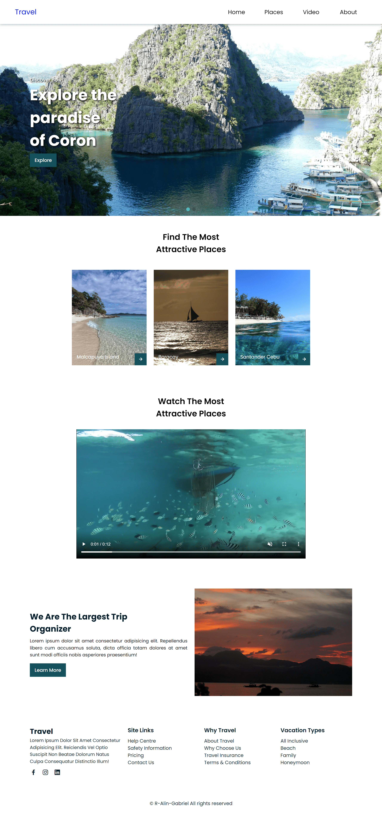

# Responsive Travel Website

#### I have built a one-page responsive Travel website with smoth scroll, swiper-slide and sticky header nav using: 
* HTML
* CSS
* JavaScript 
#### Compatible with all mobile devices and with a beautiful and pleasant user interface.

### Features 
* One Page Layout
* Custom Icons
* Sticky Navigation
* Awesome Auto Slider
* Drop Down Hamburger Menu
* On-hover Effect
* Responsive Layout
* Social Media Icons
* Rich Footer Available
* Awesome Unique Look

### Technologies

#### Project is created with:
* BoxIcons
* Auto Swiper https://swiperjs.com/demos#autoplay
* Google Font

### Files Included

* index.html
* styles.css
* app.js
* img folder

### A preview-image of the Website

